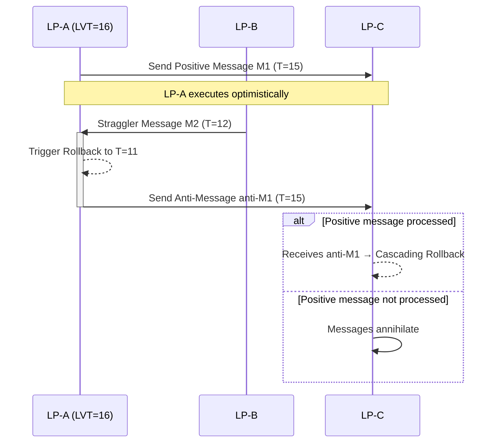

# PDES Overview: From Foundational Theories to Adaptive Co-Simulation Frameworks

## Abstract

Parallel Discrete Event Simulation (PDES) aims to accelerate large-scale Discrete Event Simulation (DES) on parallel computers. Its core challenge is to find a balance between leveraging the "speed" of parallel processing and maintaining the inherent "causal order" of DES. This report aims to **delve deeply** into the core theories and cutting-edge practices of PDES.

We will begin by examining the bottleneck of traditional sequential simulation—the "global synchronization barrier"—and analyze the operational philosophies and key mechanisms of the two foundational algorithms in the PDES field: "Conservative" and "Optimistic". Next, we will draw a cross-domain analogy between PDES and Database Management Systems (DBMS) to precisely clarify the ideological convergence and mechanistic differences between "Optimistic Concurrency Control" (OCC) and Time Warp.

The report's focus will then shift to the frontiers of PDES: "adaptive synchronization" and "co-simulation". We will analyze why any single strategy has its limitations and explore how systems can achieve dynamic policy switching. Finally, we will use the co-simulation of `ns-3` and `QEMU` as a case study to analyze how State-of-the-Art (SoA) implementations (like `SimBricks`) achieve success in engineering practice through **efficient pairwise synchronization mechanisms**. We will conclude by summarizing the new software and hardware challenges this field faces in the upcoming era of large-scale system simulation.

## 1. The Origin of the Problem — Why PDES?

### 1.1 The Bottleneck of Traditional Sequential Simulation: The Global Synchronization Barrier

Traditional Discrete Event Simulation (DES) architecture relies on a "Centralized Event Queue" or "Future Event List" (FEL).

1. All "Logical Processes" (LPs) in the system submit future events to a single, globally shared queue.
2. A central scheduler continuously extracts the event with the **minimum** timestamp ($T_{\min}$).
3. The scheduler executes this event, advancing the global virtual time to $T_{\min}$.

The advantage of this method is absolute "causal correctness". However, its performance bottleneck is significant: the **Global Synchronization Barrier**.

The root of this bottleneck is not the data structure (queue access contention) but its **time-advancement rule**. Even on a parallel computer with 1000 cores, this model forces all cores to focus on the same "present moment"—namely, $T_{\min}$. If LP-A (on core 1) wants to process an event at T=100, it must wait for LP-B (on core 2) to finish processing an event at T=5.

The system's overall performance is dragged down by the "slowest LP" or the "earliest event," completely nullifying the advantages of parallelism. PDES was born to break this "single global timeline," allowing LPs to have their own "Local Virtual Time" (LVT).

### 1.2 The Foundational Paper: PDES Overview (Fujimoto, 1990)

The foundational work in the PDES field comes from a renowned survey paper published by Richard M. Fujimoto in 1990.

* **Paper**: [Fujimoto, R. M. (1990). **Parallel discrete event simulation**. *Communications of the ACM*, 33(10), 30-53.](https://dl.acm.org/doi/10.1145/84537.84545)
* **Link**: [https://dl.acm.org/doi/10.1145/84537.84545](https://dl.acm.org/doi/10.1145/84537.84545)
* **Contribution**: Reviewing the academic history, the PDES field from the late 1970s to the 1980s was filled with various fragmented, ad-hoc synchronization ideas. One of the **primary contributions of Fujimoto (1990) was to help define the field**. He was the first to clearly categorize these chaotic methods into two major camps:
    1. **Conservative**: Algorithms that strictly "avoid" Causality Errors.
    2. **Optimistic**: Algorithms that "detect and recover from" these errors.
* **Academic Impact**: This "avoid errors vs. fix errors" dichotomy established the research landscape for PDES for decades to come and remains the fundamental classification in all PDES textbooks and research today.

## 2. Conservative Algorithms: Two Foundational Paths

The philosophy of conservative PDES algorithms is to "ensure correctness before proceeding," which means they must be 100% certain that an event's causal relationship is correct before executing it. This introduces the challenge of "deadlock". If a Logical Process (LP) is waiting for messages from multiple input channels, and one of those channels has no messages temporarily, the LP will wait indefinitely, eventually causing the entire system to halt.

Chandy and Misra, through two key papers, provided two diametrically opposed solutions to this problem:

### 2.1 Deadlock Avoidance - 1979 Paper

* **Paper**: [Chandy, K. M., & Misra, J. (1979). Distributed simulation: A case study in design and verification of distributed programs. *IEEE Transactions on Software Engineering*, SE-5(5), 440-452.](https://ieeexplore.ieee.org/document/1702653/)

* **Link**: [https://ieeexplore.ieee.org/document/1702653/](https://ieeexplore.ieee.org/document/1702653/)

* **Abstract**: "The problem of system simulation is typically solved in a sequential manner due to the wide and intensive sharing of variables by all parts of the system. We propose a distributed solution where processes communicate only through messages with their neighbors; there are no shared variables and there is no central process for message routing or process scheduling. Deadlock is avoided in this system despite the absence of global control. Each process in the solution requires only a limited amount of memory. The correctness of a distributed system is proven by proving the correctness of each of its component processes and then using inductive arguments. The proposed solution has been empirically found to be efficient in preliminary studies. The paper presents formal, detailed proofs of correctness."

* **Mechanism Analysis:**
    This is the foundational work for the "Deadlock Avoidance" strategy. Its core mechanism is the use of "Null Messages."

    In the simulation, a node (LP) must wait for messages from all its input channels to safely process the next event. If a particular channel has no "real" event messages for a long time, the system will deadlock. The Chandy-Misra algorithm solves this by sending "Null Messages". A null message carries a timestamp (say, $T_{null}$) and makes a promise to the receiver: "I will not send any message on this channel with a timestamp less than $T_{null}$". This allows the receiver to advance its "channel clock" and safely process events from other channels, thereby *avoiding* the occurrence of deadlock.

    Although this method was proven to be correct and deadlock-free, in certain topologies (especially those with feedback loops), it can lead to "flooding the system with null messages," generating significant, unnecessary message overhead.

### 2.2 Deadlock Detection and Recovery - 1981 Paper

* **Paper**: [Chandy, K. M., & Misra, J. (1981). Asynchronous distributed simulation via a sequence of parallel computations. *Communications of the ACM*, 24(4), 198-205.](https://dl.acm.org/doi/10.1145/358598.358613)

* **Link**: [https://dl.acm.org/doi/10.1145/358598.358613](https://dl.acm.org/doi/10.1145/358598.358613)

* **Abstract**: "An approach to carrying out asynchronous, distributed simulation on multiprocessor message-passing architectures is presented. This scheme differs from other distributed simulation schemes because (1) the amount of memory required by all processors together is bounded and is no more than the amount required in sequential simulation and (2) the multiprocessor network is allowed to deadlock, the deadlock is detected, and then the deadlock is broken. Proofs for the correctness of this approach are outlined."

* **Theoretical Explanation:**
    This is the foundational work for the "Deadlock Detection and Recovery" strategy. As an alternative to the 1979 paper, this algorithm *allows* the system to enter a deadlocked state. It divides the simulation into two phases:

    1. **Computation Phase**: LPs execute freely until they collectively become deadlocked while waiting for messages.
    2. **Detection and Recovery Phase**: When deadlock occurs, a distributed detection algorithm activates to confirm the deadlock. Once confirmed, the system enters a recovery phase (e.g., by finding the minimum timestamped event that can be safely advanced), and then returns to the computation phase.

    The benefit of this method is the complete avoidance of null message overhead, but its cost is the additional computational resources required to execute the detection and recovery algorithms.

    These two papers together form the complete theoretical basis for conservative PDES algorithms.

## 3. Optimistic Algorithm

### 3.1 The Optimistic Philosophy: Act First, Correct Errors Later

Optimistic algorithms adopt the exact opposite philosophy. Their core principle is **Detect & Recover**.

* **Execution Rule**: Employs "Speculative Execution". An LP **never waits**. It always immediately processes the earliest event in its local queue, optimistically assuming that "no late messages will arrive."
* **Causality Error**: When LP-A (LVT=16) optimistically finishes an event at T=15, it suddenly receives a "straggler message" from LP-B with a timestamp of T=12. This constitutes a causality error.
* **Recovery Mechanism**: LP-A must initiate a recovery mechanism, namely, "Rollback."

### 3.2 Foundational Paper: Optimistic Algorithms (Jefferson, 1985)

* **Paper**: [Jefferson, D. R. (1985). **Virtual Time**. *ACM Transactions on Programming Languages and Systems (TOPLAS)*, 7(3), 404-425.](https://dl.acm.org/doi/10.1145/3916.3988)
* **Link**: [https://dl.acm.org/doi/10.1145/3916.3988](https://dl.acm.org/doi/10.1145/3916.3988)
* **Contribution**: This paper is hailed as **one of the classic works** in the PDES field. It introduced "Virtual Time" as an abstract concept for synchronization, independent of "physical time."
* **Terminology Clarification**: Jefferson's (1985) abstract states that Time Warp relies on "...lookahead-rollback...". This is a key historical point of terminological analysis.
  * **Jefferson's (1985) Context**: In the early days when PDES terminology was not standardized, Jefferson used the *literal meaning* of "lookahead"—i.e., to execute "forward-looking" or "speculatively," and then "rollback" when an error occurred.
  * **Modern PDES Context**: In modern PDES literature, "Lookahead" is a strict *technical attribute* exclusive to conservative algorithms. It refers to the "safe time commitment" an LP can provide to its downstream LPs, guaranteeing it will send no messages before T+L (where L is the Lookahead).
  * **Conclusion**: Conservative algorithms *rely* on Lookahead to avoid deadlock. The core advantage of Time Warp is precisely that it can operate *without* Lookahead. Therefore, Jefferson's terminology at the time should be understood as "speculative execution," not the "safe time commitment" found in today's conservative algorithms.

### 3.3 Key Mechanisms: Time Warp

Jefferson's (1985) paper fully defined all the mechanisms required for Time Warp:

1. **State Saving**: As an LP executes events, it must continuously save snapshots of its historical state.
2. **Rollback:**
    * **Trigger**: Initiated by any message that violates local causal order (e.g., a **straggler message** or an **anti-message**).
    * **Mechanism**: LP-A (LVT=16) receives a straggler message at T=12. LP-A must **discard** all computations after T=12 and **restore** its internal state to the snapshot taken just before T=12.
3. **Anti-Messages:**
    * **Purpose**: "Side-effect management" for rollbacks. If LP-A, while "incorrectly" at T=15, sent a message to LP-C, then LP-A **must** immediately send a corresponding "anti-message" for T=15 when it rolls back.
    * **Annihilation**: The anti-message travels to LP-C.
        * If the anti-message arrives **first**, it waits for the positive message. The two meet in LP-C's input queue and "annihilate" each other. LP-C is never aware of the event.
        * If the positive message arrives **first** and has already been processed, the arrival of the anti-message will trigger a **cascading rollback** at LP-C.
4. **Global Virtual Time (GVT):**
    * **Definition**: GVT is the "irrevocable" time lower-bound for the entire system. The GVT calculation must consider the LVT of all LPs and the minimum timestamp of all "in-flight" messages.
    * **Use 1 - Memory Management**: State snapshots before the GVT can be safely discarded (known as "Fossil Collection") to free up memory.
    * **Use 2 - Commit**: Operations (like I/O) before the GVT are "irreversible" and can be safely committed to the outside world.

## 4. Cross-Domain "Convergent Evolution": PDES vs. DBMS

### 4.1 Philosophical Convergence

The two philosophies of PDES do not exist in isolation. In the "Concurrency Control" field of Database Management Systems (DBMS), **highly similar** ideas also evolved.

This phenomenon can be seen as "Convergent Evolution". PDES and DBMS face the same abstract problem: how to maintain consistency in a parallel environment.

* **PDES Problem**: How to ensure the final result is equivalent to some "sequential" (causally correct) execution when multiple LPs run in parallel?
* **DBMS Problem**: How to ensure the final result is equivalent to some "sequential" (Serializable) execution when multiple Transactions run in parallel?

Because they face the same fundamental challenge, these two fields independently evolved the same two types of solutions: pessimistic (avoid conflicts) and optimistic (fix conflicts).

### 4.2 Key Mechanism Comparison

The following table summarizes the analogy between PDES and DBMS in their concurrency control strategies.

**Table 1: Analogy of Concurrency Control Strategies in PDES and DBMS**

| Analogy Dimension | PDES (Parallel Discrete Event Simulation) | DBMS (Database Concurrency Control) |
|---|---|---|
| **Core Challenge** | Maintain event **Causality** | Maintain transaction **Serializability** |
| **Pessimistic/Conservative** | **Conservative** | **Pessimistic CC** |
| *Core Idea* | **Avoid** Causal Errors | **Avoid** Data Conflicts |
| *Representative Mechanism* | Chandy-Misra: Null Messages / Blocking | Two-Phase Locking (2PL): Locks / Blocking |
| *Extreme Form* | Deadlock Avoidance (1979) | Conservative 2PL |
| **Optimistic Philosophy** | **Optimistic** | **Optimistic CC (OCC)** |
| *Core Idea* | **Detect & Recover** from Errors | **Detect & Recover** from Conflicts |
| *Representative Mechanism* | Time Warp: Rollback / Anti-Messages | OCC: Validation / Abort & Restart |

### 4.3 In-Depth Analysis: Time Warp (PDES) vs. OCC (DBMS)

Although the philosophy (optimism) is similar, the trigger mechanisms for Time Warp and OCC are **significantly different**.

#### **Time Warp (PDES)**: **Passively Triggered**

This "convergent evolution" even developed into "direct borrowing". Jefferson himself once applied the Time Warp algorithm directly to the database domain.

* **Paper**: [Jefferson, D., & Motro, A. (1986). **The Time Warp mechanism for database concurrency control**. *Proceedings of the Second International Conference on Data Engineering (ICDE '86)*, 474-481.](https://ieeexplore.ieee.org/document/7266254/)
* **Link**: [https://ieeexplore.ieee.org/document/7266254/](https://ieeexplore.ieee.org/document/7266254/)
* An LP executes optimistically and *immediately* sends results (messages) to other LPs.
* A rollback is **passively triggered** by the arrival of an *external* event (a late positive message or an anti-message). The LP cannot predict when it will have to roll back.
* Time Warp's strategy can be compared to "pollute first, clean up later": broadcast messages immediately, and if an error is found (pollution), send anti-messages (clean up) to retract them.

#### **OCC (DBMS)**: **Actively Triggered**

* **Paper**: [Kung, H. T., & Robinson, J. T. (1981). **On optimistic methods for concurrency control**. *ACM Transactions on Database Systems (TODS)*, 6(2), 213-226.](https://dl.acm.org/doi/10.1145/319566.319567)
* **Link**: [https://dl.acm.org/doi/10.1145/319566.319567](https://dl.acm.org/doi/10.1145/319566.319567)
* A transaction T1 executes optimistically on a "local copy" and *never* affects the global state.
* When it wants to "Commit," it must enter a "Validation Phase," *actively* checking if its "read-set/write-set" conflicts with any other already-committed transactions.
* **Validation Failure $\to$ Abort**. All of T1's local work is discarded, and it retries from the beginning.
* OCC's strategy can be compared to "isolate first, review later": complete all work locally (in isolation), actively validate before committing (review), and only publish to the global state if validation passes.

## 5. PDES Frontiers: Adaptive Synchronization and Co-simulation

### 5.1 From Static to Dynamic: The Limitations of a Single Strategy

Long-term exploration in the PDES field has **generally shown** that **no single** static strategy (purely conservative or purely optimistic) is a **panacea**:

* **Conservative** performs exceptionally well when Lookahead is high and LPs are load-balanced, but it will deadlock when Lookahead=0.
* **Optimistic** may win out when Lookahead is low and LPs are imbalanced, but it has high memory overhead for "state-saving" and can lead to "cascading rollbacks" when conflicts are frequent, causing a performance collapse (known as "Thrashing," where the system spends the vast majority of its time rolling back and restoring state, rather than advancing the simulation).

**The prevailing view**: **No single static strategy exists** that performs best for all models and all execution phases.

**The Frontier**: "Adaptive Synchronization". The system should be able to dynamically monitor the simulation state at runtime (e.g., rollback rate, LVT progression) and switch between conservative and optimistic modes, or even use different strategies on different LPs.

### 5.2 The Challenge of Modern Co-simulation: The Case of `ns-3` and `QEMU`

Modern simulations (e.g., data center simulation) are no longer single models but "Co-simulations."

* **Case**: A researcher needs to combine a "network simulator" (`ns-3`) with a "full-system simulator" (`QEMU` or `gem5`).
* **Challenge**: `ns-3` is DES (event-driven), while `QEMU` is (typically) time-stepped or semi-event-driven. They have vastly different time-advancement models. How to synchronize them efficiently and accurately is a significant engineering challenge faced by the State-of-the-Art (SoA).

### 5.3 Case Study (SoA): The `SimBricks` Framework

For co-simulations like `ns-3` and `QEMU`, the `SimBricks` framework is a successful SoA implementation.

* **Paper**: [Li, H., Li, J., & Kaufmann, A. (2022). **SimBricks: End-to-End Network System Evaluation with Modular Simulation**. *Proceedings of the ACM SIGCOMM 2022 Conference*.](https://dl.acm.org/doi/abs/10.1145/3544216.3544253)
* Link: [https://dl.acm.org/doi/abs/10.1145/3544216.3544253](https://dl.acm.org/doi/abs/10.1145/3544216.3544253)
* **`SimBricks`'s Mechanism**: `SimBricks`'s contribution is its **Scalable Pairwise Synchronization** mechanism, which **avoids global barriers**.
* **Mechanism Details**:
    1. **Architecture**: `SimBricks` treats different simulators (like `QEMU`, `ns-3`) as independent components, connected via explicit point-to-point message channels.
    2. **Source of Lookahead**: Each channel is assigned a non-zero "Link Latency" ($\Delta_i$). This $\Delta_i$ **acts as the Lookahead** for the conservative algorithm.
    3. **Timestamp Commitment**: When simulator A (LVT=T) sends a message to B on a channel with $\Delta_i=5$, the message's timestamp is set to $T+5$. This is an implicit promise: "A will not send any message on this channel with a timestamp less than $T+5$ in the future."
    4. **LVT Advancement Rule**: Simulator B can only safely advance its LVT to $T'$ when it has received messages with timestamps $\ge T'$ on **all** its input channels.
    5. **`SYNC` Message**: If simulator A has no data to send for a long time, it sends a `SYNC` message (carrying a future timestamp commitment). This ensures "Liveness" and prevents deadlock.
* **Mechanism Analysis**: The `SimBricks` synchronization mechanism **can be seen as** a highly optimized and successful engineering implementation of the 1979 **Chandy-Misra Conservative Algorithm (CMB)** in modern co-simulation. The role of `SimBricks`'s `SYNC` message is identical to that of CMB's "Null Message."

### 5.4 Terminology Clarification: "Time-Quantum Synchronization"

In the PDES field, another conservative synchronization mechanism is often mentioned: "Time-Quantum" based synchronization.

* **Paper**: [Alian, M., et al. (2017). **dist-gem5: Distributed simulation of computer clusters**. *Proceedings of the IEEE International Symposium on Performance Analysis of Systems and Software (ISPASS)*.](https://ieeexplore.ieee.org/document/7975287)

* **Link**: [https://ieeexplore.ieee.org/document/7975287](https://ieeexplore.ieee.org/document/7975287)

* **`dist-gem5`'s Mechanism**:

    1. **Global Quantum**: The system defines a global "quantum" time interval $Q$ (e.g., 10ns).
    2. **Execution**: All LPs (gem5 simulators) execute in parallel, advancing their respective LVTs by at most $Q$.
    3. **Global Barrier**: Before its LVT reaches $T+Q$, an LP must stop and enter a "Global Sync Event."
    4. **Synchronization**: The LP waits at this barrier until **all** other LPs have reached the same barrier.
    5. **Advancement**: Once synchronization is complete, the system has ensured all messages sent between $T$ and $T+Q$ have been received. All LPs then begin the next quantum of execution (from $T+Q$ to $T+2Q$) together.

* **Mechanism Comparison**: `SimBricks` and `dist-gem5` represent two *diametrically opposed* modern conservative implementations:

  * `SimBricks` *intentionally avoids* global barriers because they are "non-scalable."
  * `dist-gem5` *explicitly relies* on a global barrier (i.e., "quantum sync") to guarantee correctness.

**Table 2: Comparison of Synchronization Mechanisms in Modern Co-simulation Frameworks**

| Feature | **`SimBricks` (Li et al., 2022)** | **`dist-gem5` (Alian et al., 2017)** |
| :--- | :--- | :--- |
| **Core Mechanism** | Pairwise Synchronization | Global Quantum Sync |
| **Sync Method** | Asynchronous / Point-to-Point | Synchronous / Global Barrier |
| **Deadlock Avoidance** | `SYNC` Messages (akin to "Null Messages") | Fixed Time Quantum (guarantees advancement) |
| **Lookahead** | Link Latency ($\Delta_i$) | Time Quantum ($Q$), where $Q \le$ min. link latency |
| **Scalability** | High (avoids global barriers) | Limited (constrained by global barrier) |

### 5.5 Conclusion: Software and Hardware Challenges in the Era of Large-Scale System Simulation

The PDES field has evolved from the "battle of theories" in the 1980s (Conservative vs. Optimistic) into an **engineering challenge** serving "large-scale system simulation" in the 2020s.

The success of `SimBricks` demonstrates that returning to the 1979 Chandy-Misra conservative principles and optimizing them in engineering (by avoiding global barriers with point-to-point channels and `SYNC` messages) is currently **a representative and efficient practice** for balancing "correctness" and "scalability" in the co-simulation domain.

In the future, the challenges for this field will revolve around both software and hardware:

* **Software**: How to further implement "adaptivity" within a conservative framework like `SimBricks`? (e.g., dynamically adjusting $\Delta_i$ or locally enabling Time Warp in high-conflict zones).
* **Hardware**: As simulation scales, LVT advancement, state-saving, GVT computation (in optimistic), or null message handling (in conservative) themselves become new bottlenecks. Future PDES will require dedicated hardware accelerators to handle the synchronization overhead.

## References

Alian, M., et al. (2017). **dist-gem5: Distributed simulation of computer clusters**. *Proceedings of the IEEE International Symposium on Performance Analysis of Systems and Software (ISPASS)*.

* [https://ieeexplore.ieee.org/document/7975287](https://ieeexplore.ieee.org/document/7975287)

Chandy, K. M., & Misra, J. (1979). **Distributed simulation: A case study in design and verification of distributed programs**. *IEEE Transactions on Software Engineering*, SE-5(5), 440-452.

* [https://ieeexplore.ieee.org/document/1702653](https://ieeexplore.ieee.org/document/1702653)

Chandy, K. M., & Misra, J. (1981). **Asynchronous distributed simulation via a sequence of parallel computations**. *Communications of the ACM*, 24(4), 198-205.

* [https://dl.acm.org/doi/10.1145/358598.358613](https://dl.acm.org/doi/10.1145/358598.358613)

Fujimoto, R. M. (1990). **Parallel discrete event simulation**. *Communications of the ACM*, 33(10), 30-53.

* [https://dl.acm.org/doi/10.1145/84537.84545](https://dl.acm.org/doi/10.1145/84537.84545)

Jefferson, D. R. (1985). **Virtual Time**. *ACM Transactions on Programming Languages and Systems (TOPLAS)*, 7(3), 404-425.

* [https://dl.acm.org/doi/10.1145/3916.3988](https://dl.acm.org/doi/10.1145/3916.3988)

Jefferson, D., & Motro, A. (1986). **The Time Warp mechanism for database concurrency control**. *Proceedings of the Second International Conference on Data Engineering (ICDE '86)*, 474-481.

* [https://ieeexplore.ieee.org/document/7266254/](https://ieeexplore.ieee.org/document/7266254/)

Kung, H. T., & Robinson, J. T. (1981). **On optimistic methods for concurrency control**. *ACM Transactions on Database Systems (TODS)*, 6(2), 213-226.

* [https://dl.acm.org/doi/10.1145/319566.319567](https://dl.acm.org/doi/10.1145/319566.319567)

Li, H., Li, J., & Kaufmann, A. (2022). **SimBricks: End-to-End Network System Evaluation with Modular Simulation**. *Proceedings of the ACM SIGCOMM 2022 Conference*.

* [https://dl.acm.org/doi/abs/10.1145/3544216.3544253](https://dl.acm.org/doi/abs/10.1145/3544216.3544253)
* **GitHub Project**: [https://github.com/simbricks/simbricks](https://github.com/simbricks/simbricks)
