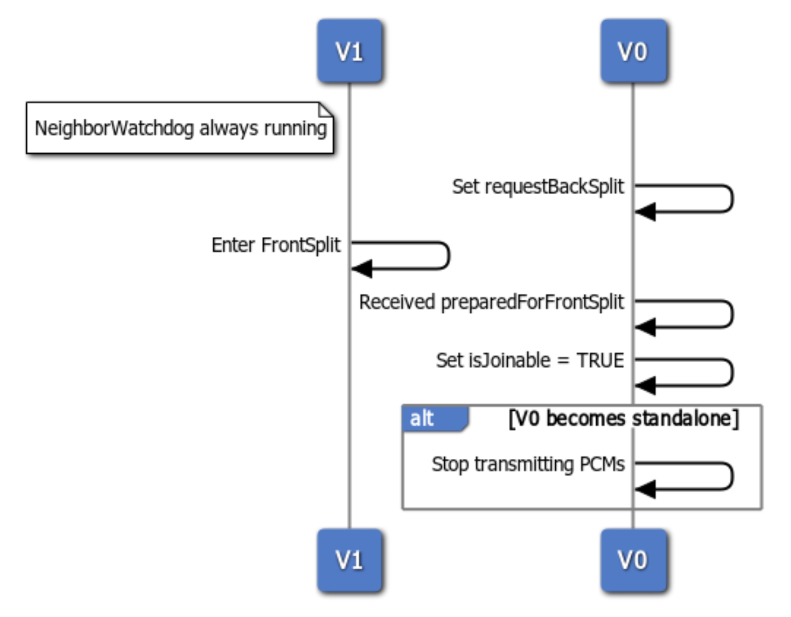

# Truck Platooning Technology Research and Preliminary Design of V2X Communication System Based on Autoware/Zenoh/QUIC

> * *[Final Version Functional specification for white-label truck.pdf](./ref/Final%20Version%20Functional%20specification%20for%20white-label%20truck.pdf)*
> * *[Platooning protocol definition and communication strategy.pdf](./ref/Platooning%20protocol%20definition%20and%20communication%20strategy.pdf)*
> * *[V2 Platooning use cases.pdf](./ref/V2%20Platooning%20use%20cases.pdf)*

## 1. Introduction

### 1.1 Platooning

Multiple vehicles (especially trucks) follow in close proximity and coordinated manner. Benefits include:

* **Fuel Savings:** Reduced aerodynamic drag.
* **Enhanced Safety:** V2X coordinated responses (e.g., synchronized braking).
* **Increased Road Capacity:** Shortened inter-vehicle gaps.

### 1.2 ENSEMBLE Project

* **ENSEMBLE (ENabling SafE Multi-Brand pLatooning for Europe):** European Horizon 2020 project.
* **Objective:** Pave the way for widespread adoption of **multi-brand truck** platooning in Europe by establishing interoperability standards and accelerating market applications.
* **Primary Reference in This Study:** Based on technical specifications and protocols defined in ENSEMBLE public documents.

### 1.3 Objectives

1. Summarize learning outcomes on ENSEMBLE Platooning technology (PSF/PAF) and V2X communication protocols.
2. Explore preliminary concepts for integrating Platooning V2X communication into the Autoware/Zenoh/QUIC system architecture.

### 1.4 Outline

1. Introduction
2. Platooning Fundamental Concepts (Based on ENSEMBLE)
3. Platooning Support Function (PSF): Driver Assistance
4. Platooning Autonomous Function (PAF): Toward Automation
5. ENSEMBLE V2X Communication Protocol (Based on ITS-G5)
6. Future Outlook

## 2. Platooning Fundamental Concepts (Based on ENSEMBLE)

### 2.1 ENSEMBLE Hierarchical Architecture

* Decomposes complex systems into layers with distinct responsibilities to promote modularity and interoperability.

<!--  Fig. 1-1](./img/C-ITS-protocol-stack-and-ensemble-protocol.png) -->
 Fig. 2](./img/ensemble-platooning-layers.png)

> * *[Final Version Functional specification for white-label truck.pdf](./ref/Final%20Version%20Functional%20specification%20for%20white-label%20truck.pdf) (Page 15-16, Fig. 2)*
> * *[V2 Platooning use cases.pdf](./ref/V2%20Platooning%20use%20cases.pdf) (Page 13, Fig. 1-1)*

### 2.2 Layer Responsibilities

| Layer              | Primary Responsibilities                  | Description                                                  |
| :----------------- | :---------------------------------------- | :----------------------------------------------------------- |
| **Services Layer** | Logistics Operations / Value-Added Services | Provides interfaces for logistics platforms and new business models. |
| **Strategic Layer**| High-Level Decision / Route Planning / Platoon Scheduling | Optimizes based on vehicle compatibility, fuel consumption, destinations, etc., typically at control center. |
| **Tactical Layer** | Platoon Coordination (Formation/Dissolution/Condensation/Gap) | Executes interaction protocols via V2V to coordinate platoon operations. |
| **Operational Layer** | Vehicle Actuator Control (Acceleration/Deceleration/Steering) | Performs specific driving operations to maintain speed/gap and ensure stability. |

> * *[Final Version Functional specification for white-label truck.pdf](./ref/Final%20Version%20Functional%20specification%20for%20white-label%20truck.pdf) (Page 15-16)*
> * *[V2 Platooning use cases.pdf](./ref/V2%20Platooning%20use%20cases.pdf) (Page 13-14)*

### 2.3 Platooning Levels Overview (PSF vs PAF)

ENSEMBLE primarily defines two levels, with core difference in **driver responsibility**.

| Level | Name                           | Driver Responsibility (Following Vehicle) | Automation Level (Following Vehicle) | Time Gap (Approx.) | ENSEMBLE Implementation Status |
| :---- | :----------------------------- | :---------------------------------------- | :----------------------------------- | :----------------- | :----------------------------- |
| PSF   | Platooning Support Function    | **Driver Responsible**                    | Longitudinal Assistance (Similar to ACC) | ~1.5 seconds       | In Practical Use               |
| PAF   | Platooning Autonomous Function | **System Responsible**                    | Full Longitudinal + Lateral Automation   | 0.3 - 1.2 seconds  | Theoretical Research Phase     |

> * *[Final Version Functional specification for white-label truck.pdf](./ref/Final%20Version%20Functional%20specification%20for%20white-label%20truck.pdf) (Page 8-9, 111)*
> * *[V2 Platooning use cases.pdf](./ref/V2%20Platooning%20use%20cases.pdf) (Page 9, 16-17, Table 2-1)*

## 3. Platooning Support Function (PSF): Driver Assistance

### 3.1 Core Concepts and Driver Responsibility

* **Concept:** V2X-enhanced ACC (Adaptive Cruise Control).
* **Driver Responsibility:**
  * Driver must handle **full** Dynamic Driving Task (DDT).
  * Includes longitudinal (throttle/brake) and lateral (steering) control.
  * Driver must select safe following distance and **continuously monitor** system and environment.
  * System provides **assistance** only; driver is ultimate fallback.

> * *[Final Version Functional specification for white-label truck.pdf](./ref/Final%20Version%20Functional%20specification%20for%20white-label%20truck.pdf) (Page 9, 18, 20)*
> * *[V2 Platooning use cases.pdf](./ref/V2%20Platooning%20use%20cases.pdf) (Page 9, 16, 18)*

### 3.2 Key Features: Time Gap and Control Limits

* **Safe Time Gap:**
  * Approximately **1.4 - 1.6 seconds**.
  * Similar to ACC, primarily to ensure **sufficient driver reaction time**.
  * Driver can typically adjust this setting (if provided by system).
* **Longitudinal Control Limits:**
  * System provides longitudinal acceleration/deceleration assistance.
  * Maximum deceleration typically limited (e.g., ENSEMBLE sets $\le 3.5 m/s^2$) to avoid abrupt automatic braking and maintain driver controllability.
* **Lateral Control:**
  * **Not Required**. Driver handles steering.
  * Optional lane-keeping assistance possible.
  
| Feature          | PSF Description                          | Primary Consideration       |
| :--------------- | :--------------------------------------- | :-------------------------- |
| Time Gap         | ~1.5 seconds                             | Driver Reaction Time        |
| Longitudinal Control | Assistance with Limits (e.g., Decel $\le 3.5 m/s^2$) | Driver Comfort/Controllability |
| Lateral Control  | Driver Responsible (Optional Assistance) | Driver Responsibility       |

> * *[Final Version Functional specification for white-label truck.pdf](./ref/Final%20Version%20Functional%20specification%20for%20white-label%20truck.pdf) (Page 9, 47-48, PSF_Long_Control_001, PSF_Long_Control_005)*
> * *[V2 Platooning use cases.pdf](./ref/V2%20Platooning%20use%20cases.pdf) (Page 9, 17, 18)*

### 3.3 V2V Benefits: Enhanced Safety and Efficiency

* **Beyond Sensors:** V2V allows sharing of **intentions** and **internal states**, not just current states detected by sensors.
* **Key V2V Information (in PCM):**
  * `predictedLongitudinalAcceleration`
  * `currentLongitudinalAcceleration`
  * Brake Status
  * Position, Speed, Heading, etc.
* **Benefits:**
  * **Earlier Warning:** Detect lead vehicle braking intent earlier than sensors $\rightarrow$ Advance driver warning.
  * **Faster Response:** System can initiate limited deceleration before sensor confirmation $\rightarrow$ Gain reaction time.
  * **Smoother Control:** Predict intentions $\rightarrow$ Avoid abrupt acceleration/deceleration, improve comfort and potential fuel efficiency.
  

> * *[Final Version Functional specification for white-label truck.pdf](./ref/Final%20Version%20Functional%20specification%20for%20white-label%20truck.pdf) (Page 20, 26-29, Table 3, 48)*
> * *[Platooning protocol definition and communication strategy.pdf](./ref/Platooning%20protocol%20definition%20and%20communication%20strategy.pdf) (Page 31, 81-83)*

### 3.4 Use Case: Joining Platoon from Behind

Ego vehicle wishes to join allowable (Joinable) Target vehicle or platoon ahead. Process:

* [Platooning protocol definition and communication strategy.pdf](./ref/Platooning%20protocol%20definition%20and%20communication%20strategy.pdf) [Fig. 8](./img/join-seq-high-level.png)
* [Platooning protocol definition and communication strategy.pdf](./ref/Platooning%20protocol%20definition%20and%20communication%20strategy.pdf) [Fig. 9](./img/join-seq-details.png)

* **Key Points:**
  * V2V (PMM) for coordinating join request/response
  * V2V (CAM) for opportunity discovery
  * V2V (PCM) for stable driving. Driver monitors throughout

> * *[V2 Platooning use cases.pdf](./ref/V2%20Platooning%20use%20cases.pdf) (Page 33-35, PSF_2.1)*
> * *[Platooning protocol definition and communication strategy.pdf](./ref/Platooning%20protocol%20definition%20and%20communication%20strategy.pdf) (Page 32-37, Fig. 8, Fig. 9)*

### 3.5 Human-Machine Interface (HMI) Focus

* **Goal:** Clearly convey system status, facilitate driver operation, maintain **Situational Awareness**.
* **Universal HMI Logic:** Ensure multi-brand interoperability and consistent experience.
* **Key Display Information:**
  * System Mode (Enabled/Connecting/In Platoon/ACC)
  * Platoon Position (Lead/Middle/Tail)
  * Reason for System Adjustments
  * V2I Information (Suggested Speed/Gap)
  * **Warnings** (Fault/Limit/Emergency Brake/Condensation Request)
* **Key Driver Inputs:**
  * Enable/Disable PSF
  * Adjust Target Gap (if available)
  * **Override Anytime** (Brake/Steer)

> * *[Final Version Functional specification for white-label truck.pdf](./ref/Final%20Version%20Functional%20specification%20for%20white-label%20truck.pdf) (Page 36-45, Appendix B)*

## 4. Platooning Autonomous Function (PAF): Toward Automation

### 4.1 Core Concepts and Responsibility Shift

* **Core Concept:** Lead Truck guided by driver; following trucks (Following/Trailing Trucks) fully handled by **system** for Dynamic Driving Task (DDT).
* **Responsibility Shift:**
  * **Following Vehicle System:** Responsible for own safety, (optional) follow traffic rules (primarily rely on lead behavior).
  * **Following Vehicle Driver (if present):** Becomes passenger, **no need** to monitor DDT.
  * **Lead Vehicle Driver:** Guides platoon, complies with traffic rules, responsible for own vehicle safety, **not** for following vehicles.
  

> * *[Final Version Functional specification for white-label truck.pdf](./ref/Final%20Version%20Functional%20specification%20for%20white-label%20truck.pdf) (Page 9, 58-59, Fig. 7)*
> * *[V2 Platooning use cases.pdf](./ref/V2%20Platooning%20use%20cases.pdf) (Page 9, 16-17, 67-68, Table 5-4)*

### 4.2 Key Features: Small Gaps and Follow-me

* **Smaller Time Gaps:**
  * Theoretical potential: Down to **0.3 seconds** (ideal conditions).
  * Reason: System reacts faster than human, **no need** to reserve driver reaction time.
  * Benefits: Significant fuel efficiency and road capacity improvements.
* **Follow-me / Auto-follow Function:**
  * Following vehicle system must precisely track lead (or preceding) vehicle's path and dynamics.
  * Highly reliant on V2V-transmitted path information and real-time states.
  
| Feature          | PAF Description                  | Primary Reason/Benefit              |
| :--------------- | :------------------------------- | :---------------------------------- |
| Time Gap         | Down to 0.3 seconds              | No Human Reaction Time / Enhanced Benefits |
| Follow Mode      | Follow-me / Auto-follow          | System Autonomously Tracks Lead Path |
| Driver Responsibility (Following) | System                           | Automation Core                     |

> * *[Final Version Functional specification for white-label truck.pdf](./ref/Final%20Version%20Functional%20specification%20for%20white-label%20truck.pdf) (Page 9, 59, 86-87, Table 13)*
> * *[V2 Platooning use cases.pdf](./ref/V2%20Platooning%20use%20cases.pdf) (Page 17, 69)*

### 4.3 Comparison with SAE L4 Autonomous Driving - SAE L4 Overview

* **SAE L4 (High Driving Automation) Overview:**
  * System **fully** executes DDT within its **ODD**, **no driver monitoring** required.
  * ODD: Preset specific operational conditions (geography, roads, weather, time, etc.).
  * Outside ODD: System inactive or requires human takeover.
  * Fault within ODD: System must **autonomously** reach minimal risk state (e.g., safe stop).
  

> * *[Final Version Functional specification for white-label truck.pdf](./ref/Final%20Version%20Functional%20specification%20for%20white-label%20truck.pdf) (Page 59, 67-69)*
> * *SAE J3016 standard*

### 4.4 PAF Following Truck vs. Independent L4 Truck - PAF vs L4

| Feature                  | PAF Following Truck                              | Independent L4 Truck                             |
| :----------------------- | :----------------------------------------------- | :----------------------------------------------- |
| **Similarities**         | No driver intervention in ODD; Requires high-level perception/planning/control | No driver intervention in ODD; Requires high-level perception/planning/control |
| **High-Level Decision**  | **Simplified** (Relies on lead guidance/V2V path) | **Fully Autonomous** (Route planning, traffic decisions) |
| **Traffic Rules**        | **Optionally Simplified** (Relies on lead behavior) | **Fully Autonomous** (Recognize signs/markers and comply) |
| **V2X Dependency**       | **Strong Dependency** (Core function, needs low-latency/high-reliability V2V) | **Optional/Assistance** (Core not fully dependent on V2X) |
| **Trajectory Planning Focus** | **Precise Following** of lead trajectory (small gap) | **Autonomous Navigation** and **Obstacle Avoidance** |
| **Additional Risks**     | V2V communication interruption; Lead error guidance | Primarily own perception/decision errors         |

* **Positioning:** PAF can be viewed as a specific application form between L2/L3 (assistance/conditional automation) and L4 (high automation).

> * *[Final Version Functional specification for white-label truck.pdf](./ref/Final%20Version%20Functional%20specification%20for%20white-label%20truck.pdf) (Page 59, 69-73, Table 8, Table 9)*

### 4.5 Key Technical Challenges (1/2): Brake Performance Estimation (BPE)

* **Foundation for PAF small gaps** (e.g., 0.3s @ 90km/h ≈ 7.5m). Following vehicle must predict own and lead's maximum braking capability to calculate safe distance and respond timely.
* Difficulty: Braking performance **highly dynamic** and influenced by multiple factors.

* Challenges: Many factors hard to measure instantly/accurately (especially road friction).
* Directions: Sensor fusion, physical models, V2X information sharing.

> * *[Final Version Functional specification for white-label truck.pdf](./ref/Final%20Version%20Functional%20specification%20for%20white-label%20truck.pdf) (Page 77, 79-88, Table 11, Table 13)*

### 4.6 Key Technical Challenges (2/2): Perception, Fault Tolerance, Infrastructure

* **High-Precision Perception & Localization:**
  * Requires 360° perception, precise object/lane/passable space identification.
  * Needs centimeter-level positioning for precise following and lane changes.
  * Requires strong prediction of other objects' behavior.
* **Fault Tolerance & Safe State:**
  * System must handle hardware failures, software errors, communication interruptions.
  * When unable to operate safely (beyond ODD or fault), autonomously enter preset safe state (e.g., pull over, stop in area or brake to stop).
  
  * **Infrastructure Support:**
  * Some complex scenarios (e.g., intersections, roundabouts) may rely on **smart road infrastructure (V2I)** for information or coordination (e.g., ENSEMBLE ISAD Level B).
  * Requires clear road markings, good pavement conditions.

> * *[Final Version Functional specification for white-label truck.pdf](./ref/Final%20Version%20Functional%20specification%20for%20white-label%20truck.pdf) (Page 58, 71, 93-97, 108, 110, Fig. 15, 142-144)*
> * *[V2 Platooning use cases.pdf](./ref/V2%20Platooning%20use%20cases.pdf) (Page 71-74, 137, 142-145)*

### 4.7 Operational Design Domain (ODD) and Complex Use Cases

* **Restricted ODD:** Initial PAF ODD more limited than L4, primarily:
  * Specific highways.
  * Hub-to-Hub transportation.
  * Short roads connecting hubs and highways (may include intersections/roundabouts).
* **Complex Use Cases (vs PSF):**
  * **Autonomous Lane Change/Merge:** System autonomously assesses, plans, executes.
  * **Intersection/Roundabout Handling:** Needs V2I coordination or autonomous judgment.
  * **Toll Stations:** Requires special "Lateral Following" mode.
  * **More Autonomous Anomaly Handling:** Autonomously respond to intrusions and enter safe state.

| Use Case         | PSF Primary Behavior | PAF Primary Behavior                  |
| :--------------- | :------------------- | :------------------------------------ |
| Lane Change      | Driver Operation     | System Autonomous Assess/Plan/Execute |
| Intersection/Roundabout | (Usually Not Applicable) | Needs V2I Coordination or Autonomous Judgment |
| Toll Station     | Driver Operation     | Enable "Lateral Following" Mode       |
| Communication Interrupt/Fault | Driver Takeover/Increase Gap | System Autonomously Assess and Enter "Safe State" |

> * *[V2 Platooning use cases.pdf](./ref/V2%20Platooning%20use%20cases.pdf) (Page 69-74, 77-131)*
> * *[Final Version Functional specification for white-label truck.pdf](./ref/Final%20Version%20Functional%20specification%20for%20white-label%20truck.pdf) (Page 58, 73, 110)*

## 5. ENSEMBLE V2X Communication Protocol

### 5.1 Core Message Types: PMM (Management)

* **PMM (Platooning Management Message):** For platoon formation, maintenance, dissolution. Event-triggered, lower frequency.
* **Main Subtypes:**
  * **Join Request:** Sent by joiner.
    * Key Fields: `receiver`, `numberOfTrucks`, `responseKey` (public key), `vehicleConfiguration`, `platooningLevel`.

    * **Main Subtypes:**
  * **Join Response:** Replied by requested.
    * Key Fields: `respondingTo`, `joinResponseStatus` (allow/deny).
    * If allow: Includes `JoinResponseInfo`: `groupKey (PGK)`, `participantKey (PPK)`, `platoonId`, `joiningAtPosition`.
  * **Platoon Update:** Initiated by Leader for key or state updates.
    * Key Fields: `groupKey (PGK)`, `participantKey (PPK)`, `platoonId`, `updatedPosition`.

> * *[Platooning protocol definition and communication strategy.pdf](./ref/Platooning%20protocol%20definition%20and%20communication%20strategy.pdf) (Page 32, 37, 41, 84-85)*

### 5.2 Core Message Types: PCM (Control)

* **PCM (Platooning Control Message):** High-frequency (20Hz) exchange of states and intentions during stable driving for precise control.
* **Main Containers:**
  * **LongitudinalControl:** `current/predicted Acceleration`, `Speed`, `Weight`, `IntruderAhead`...
  * **LateralControl (Optional):** `lateral Acceleration`, `YawRate`, `LaneDistance`...
  * **PlatoonStatusSharing:** `NrOfTrucks`, `platoonSpeed`, `platoonPosition`, `platoonID`, `Reason`...
  * **TacticalPlanning (Optional):** `cohesionContainer` (`requestedMaxSpeed/Accel`)...
  * **SplitStatus:** `frontSplit` (status), `requestBackSplit` (request)...

> * *[Platooning protocol definition and communication strategy.pdf](./ref/Platooning%20protocol%20definition%20and%20communication%20strategy.pdf) (Page 32, 81-84)*

### 5.3 Communication Flow: Joining Platoon

* **Key Steps:** CAM discovery $\rightarrow$ PMM request/response $\rightarrow$ Key exchange $\rightarrow$ PCM starts.

> * *[Platooning protocol definition and communication strategy.pdf](./ref/Platooning%20protocol%20definition%20and%20communication%20strategy.pdf) (Page 32-37, Fig. 8, Fig. 9)*

### 5.4 Communication Flow: Leaving/Splitting

* **Core Mechanism:** Coordinated via `SplitStatus` fields in PCM.
* **Basic Modules:**
  * **Front Split:** Disconnect from **preceding** vehicle.
        1. Ego sets `preparingForFrontSplit` in PCM.
        2. (Optional) Ego increases gap.
        3. Ego sets `preparedForFrontSplit` in PCM (briefly).
        4. Ego stops communication with preceding, transitions state (Standalone or New Leader).
  * **Back Split:** Disconnect from **following** vehicle.
        1. Ego sets `requestBackSplit=TRUE` in PCM.
        2. Following vehicle receives, initiates **own** Front Split.
        3. Following sets `preparedForFrontSplit` in its PCM.
        4. Ego receives, stops communication with following, transitions state (Trailing or Standalone).

|             `frontSplit`             |             `backSplit`              |
| :----------------------------------: | :----------------------------------: |
|  |  |

> * *[Platooning protocol definition and communication strategy.pdf](./ref/Platooning%20protocol%20definition%20and%20communication%20strategy.pdf) (Page 38-41, Fig. 10, Fig. 11, 83)*

### 5.5 Security Mechanisms: Signing, Encryption, Key Updates

* **Authentication/Integrity:** All V2X messages (CAM, PMM) use PKI **digital signing** + **verification**.
* **PCM Confidentiality:** PCM content uses **symmetric encryption**.
  * **Keys:**
    * PGK (Platoon Group Key): Shared by platoon, encrypts broadcast PCM.
    * PPK (Platoon Participant Key): Shared by adjacent pairs, encrypts Platoon Update etc.
  * **Distribution:** Generated and distributed by Leader in Join Response.
* **Key Updates (Platoon Update):**
  * **Purpose:** Periodically (e.g., 60s) update PGK/PPK for security.
  * **Flow:** Leader initiates $\rightarrow$ Propagates backward new keys (PMM) $\rightarrow$ Tail activates first $\rightarrow$ Forward confirmation (based on receiving following's PCM with new key).
* Refer to [Platooning protocol definition and communication strategy.pdf](./ref/Platooning%20protocol%20definition%20and%20communication%20strategy.pdf) [Fig. 12 sequence diagram](./img/platoon-update-seq.png)

> * *[Platooning protocol definition and communication strategy.pdf](./ref/Platooning%20protocol%20definition%20and%20communication%20strategy.pdf) (Page 18, 30, 33, 41-44, Fig. 12)*
> * *ENSEMBLE D2.9 - Security Framework of Platooning*

### 5.6 Reliability Mechanism: Neighbor Watchdog

* **Purpose:** Detect communication interruption with adjacent vehicles, trigger safe operations.
* **Mechanism:**
    1. Continuously monitor receipt of direct preceding/following PCM every 50ms.
    2. If exceeds `PCM_TIMEOUT` (suggested 150ms):
          * No **preceding** PCM $\rightarrow$ Trigger **Front Split**.
          * No **following** PCM $\rightarrow$ Trigger **Back Split**.
* **Role:** Ensure timely, automatic safe detachment or reorganization upon communication loss.
* Refer to [Platooning protocol definition and communication strategy.pdf](./ref/Platooning%20protocol%20definition%20and%20communication%20strategy.pdf) [Fig. 13 sequence diagram](./img/neighbour-watchdog-seq.png)

> * *[Platooning protocol definition and communication strategy.pdf](./ref/Platooning%20protocol%20definition%20and%20communication%20strategy.pdf) (Page 45-46, Fig. 13)*

## 6. Future Outlook

* **Refine Zenoh Architecture:**
  * Finalize Topics structure.
  * Select and define data serialization format (e.g., Protobuf schema).
* **Design Autoware-Zenoh Bridge:**
  * Specify Autoware Topics to bridge.
  * Design data conversion logic.
* **Draw Detailed Communication Flowcharts (Mermaid Sequence Diagrams):**
  * For key scenarios (Join, Leave, Stable Following, Emergency Brake, Cut-in).
  * Mark Autoware nodes, Zenoh, wireless transmission links.
* **Define Data Objects and Format Details:**
  * Create Protobuf or .msg definitions for PMM/PCM.
* **Specify Timing Constraints and Anomaly Handling:**
  * Define latency budgets for critical paths.
  * Design communication failure handling flows.

## 7. References

* ENSEMBLE Project Deliverable D2.3 (Jan 2022). *V2 Platooning use cases, scenario definition and Platooning Levels*. [[V2 Platooning use cases.pdf](./ref/V2%20Platooning%20use%20cases.pdf)]
* ENSEMBLE Project Deliverable D2.5 (Jan 2022). *Final Version Functional specification for white-label truck*. [[Final Version Functional specification for white-label truck.pdf](./ref/Final%20Version%20Functional%20specification%20for%20white-label%20truck.pdf)]
* ENSEMBLE Project Deliverable D2.8 (Mar 2022). *Platooning protocol definition and communication strategy*. [[Platooning protocol definition and communication strategy.pdf](./ref/Platooning%20protocol%20definition%20and%20communication%20strategy.pdf)]
* ENSEMBLE Project Deliverable D2.9 (Jan 2022). *Security framework of platooning*. (Not provided, but cited multiple times in D2.8)
* SAE J3016 (Apr 2021). *Taxonomy and Definitions for Terms Related to Driving Automation Systems for On-Road Motor Vehicles*.
* Zenoh Website: <https://zenoh.io/>
* QUIC RFC 9000: <https://datatracker.ietf.org/doc/html/rfc9000>